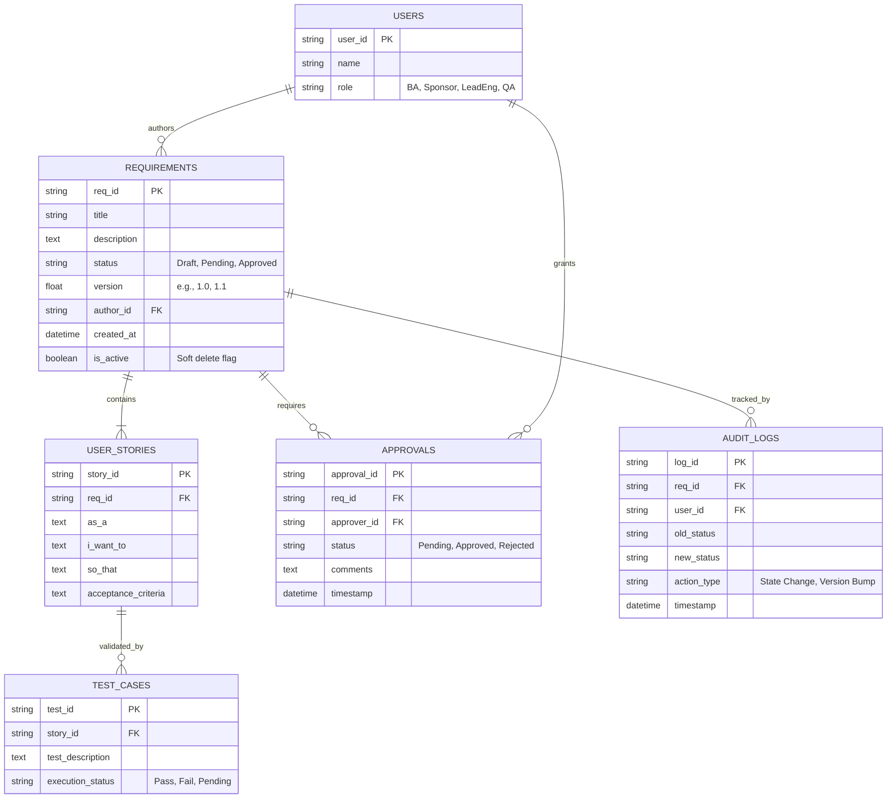

# Phase 6: Data Design
**Project:** Enterprise Requirements & Decision Management Platform (ERDMP)
**Role:** Lead Data Architect

---

## 1. Database Philosophy
To achieve 100% traceability and compliance audit readiness, the database must be in **3rd Normal Form (3NF)**. We must strictly separate the transactional hierarchy (Requirements -> Stories -> Tests) from the historical ledger (Audit Logs). No row in the core entity tables should ever be fully deleted (soft deletes only).

---

## 2. Entity Relationship Diagram (ERD)

---

## 3. Core Table Definitions & Normalization

### 3.1 Transactable Hierarchy
1. **`users` (Reference Data):** Static table defining personnel. The `role` column strictly enforces application-level RBAC.
2. **`requirements` (Core Entity):** The parent object. The `version` column is highly critical. Every time a requirement is edited after approval, the existing row is NOT overwritten. Instead, the `is_active` flag is set to `False`, and a new row with `version + 0.1` is inserted (Type 2 Slowly Changing Dimension strategy).
3. **`user_stories`:** Child of `requirements`. Holds the BDD syntax.
4. **`test_cases`:** Child of `user_stories`. Contains the UAT execution results.

### 3.2 The Immutable Ledger
5. **`audit_logs` (System of Record):** This is an **Append-Only** table. It tracks every state transition (e.g., Draft -> Pending). If an auditor asks, *"Who approved V1.0 of Requirement X on Tuesday?"*, this table provides the immutable cryptographic timestamp.

### 3.3 The Approval Junction
6. **`approvals`:** A junction table handling the many-to-many relationship between `users` (Sponsors) and `requirements`. It tracks the signature status (`Pending`, `Approved`, `Rejected`) and captures rejection comments.

---

## 4. Indexing Strategy
To ensure the UI dashboards load instantly even with thousands of historical records:
- **Index 1:** `idx_req_status` on `requirements(status)` -> Optimizes the "Pending Approvals" dashboard for Sponsors.
- **Index 2:** `idx_audit_req` on `audit_logs(req_id)` -> Optimizes the retrieval of the historical timeline on the Requirement detail page.
- **Index 3:** `idx_story_req` on `user_stories(req_id)` -> Optimizes the generation of the Traceability Matrix tree.

---

## 5. Security & Integrity Constraints
- **Foreign Key Constraints:** `PRAGMA foreign_keys = ON;` must be strictly enforced in SQLite to prevent orphaned User Stories.
- **No Hard Deletes:** A trigger or application logic must block `DELETE` statements on `requirements`. All removals are handled via `UPDATE requirements SET is_active = 0`.
