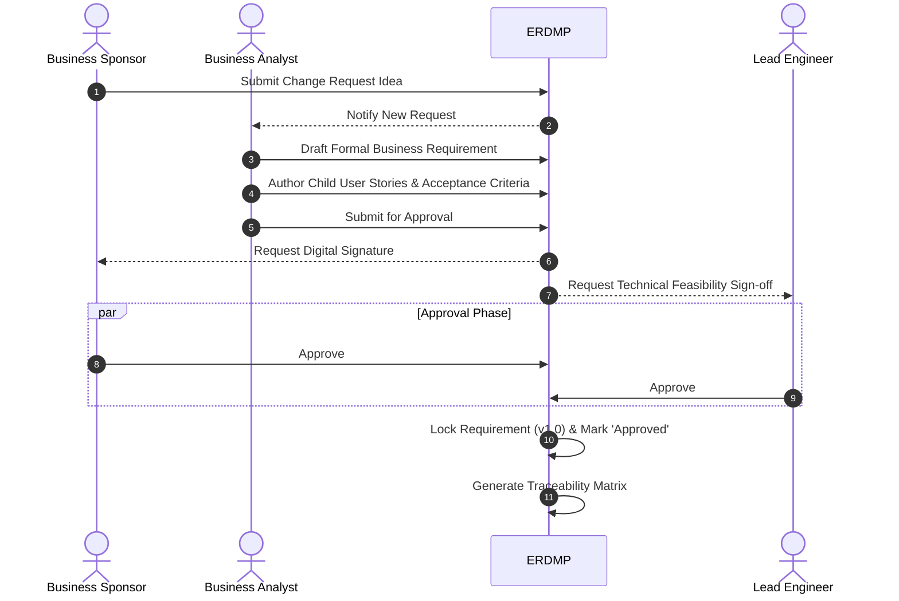
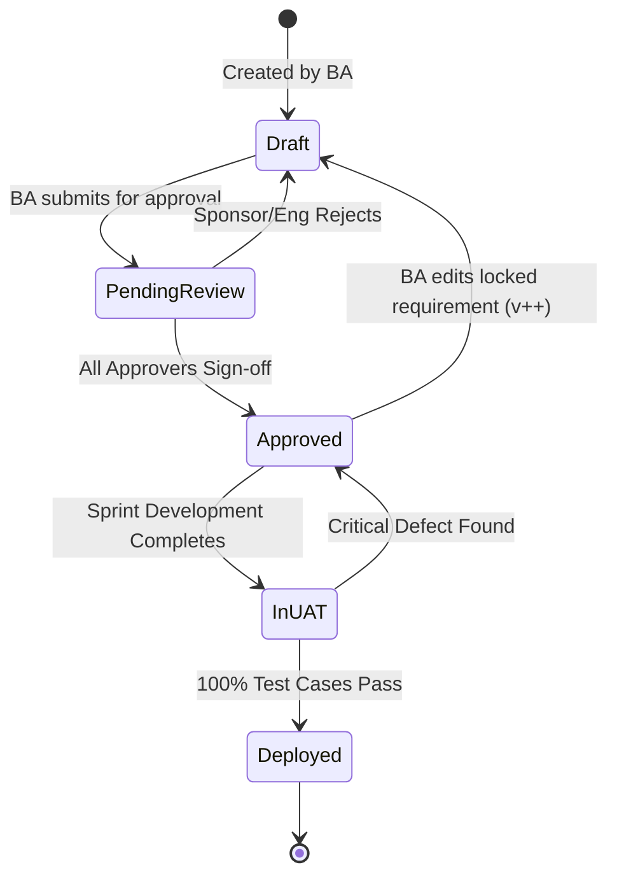

# Phase 3: Requirements Engineering
**Project:** Enterprise Requirements & Decision Management Platform (ERDMP)
**Role:** Lead Business Analyst

---

## 1. Business Requirements Document (BRD)
### 1.1 Purpose
The purpose of the ERDMP is to replace ad-hoc, email-and-document-based requirement management with a centralized, state-driven platform. It ensures every software change request is formally captured, traced, approved, and validated before deployment.

### 1.2 Core Business Requirements
- **BRQ-01:** The system shall provide a unified dashboard for Business Sponsors to view the real-time status (Draft, Pending Review, Approved, UAT, Deployed) of all their submitted change requests.
- **BRQ-02:** The system shall enforce a strict digital approval workflow requiring cryptographic or authenticated sign-off from designated stakeholders.
- **BRQ-03:** The system shall automatically generate a Requirement Traceability Matrix (RTM) linking Business Requirements to User Stories and UAT Test Cases.
- **BRQ-04:** The system shall maintain an immutable audit trail of all status changes, comment history, and version increments.

---

## 2. Functional Requirements Document (FRD)
### 2.1 Epic 1: Requirement Authoring & Versioning
- **FRQ-1.1:** The platform must allow Business Analysts to create a "Business Requirement Object" containing Title, Description, Business Value, and Target Release Date.
- **FRQ-1.2:** Any modification to a Requirement Object that is in "Approved" status must automatically create a new version (e.g., v1.1) and revert the status to "Draft".
- **FRQ-1.3:** The platform must support rich-text editing (Markdown) for requirement descriptions.

### 2.2 Epic 2: Approval Workflows
- **FRQ-2.1:** BAs must be able to assign "Approver" roles to specific users for a given Requirement Object.
- **FRQ-2.2:** The system must send automated email/platform notifications to Approvers when a Requirement enters "Pending Review".
- **FRQ-2.3:** Approvers must be able to select "Approve" or "Reject with Comments". 

### 2.3 Epic 3: Traceability & User Stories
- **FRQ-3.1:** BAs must be able to create "User Story Objects" as direct children of a "Business Requirement Object".
- **FRQ-3.2:** User Story Objects must enforce the standard "As a [role], I want to [action], so that [benefit]" format.
- **FRQ-3.3:** User Story Objects must contain a mandatory "Acceptance Criteria" field.

---

## 3. Business Process Modeling (BPMN)

### "As-Is" vs "To-Be" Requirement Lifecycle

---

## 4. System State Machine (UML)

### Requirement Object State Transitions

---

## 5. Detailed User Stories & Acceptance Criteria

### Epic: Approval Workflows
**User Story: US-AUTH-001**
> **As a** Business Sponsor  
> **I want to** view a consolidated queue of requirements awaiting my approval  
> **So that** I can review and sign off on them without searching through my email inbox.

**Acceptance Criteria:**
1. **Given** I am logged in as a Business Sponsor, **When** I navigate to the "My Approvals" dashboard, **Then** I see a list of all Requirements where my status is 'Pending'.
2. **Given** the list of pending approvals, **When** I click on a Requirement, **Then** I can see the full description, linked User Stories, and a history of previous comments.
3. **Given** I am reviewing a Requirement, **When** I click "Approve", **Then** my digital signature (timestamp and user ID) is logged in the Audit Table, and the system checks if all approvers have signed off.

### Epic: Traceability Matrix
**User Story: US-TRC-005**
> **As a** QA Validator  
> **I want to** view a matrix linking Test Cases to User Stories to Business Requirements  
> **So that** I can prove to compliance auditors that we only built what was requested.

**Acceptance Criteria:**
1. **Given** an Approved Business Requirement, **When** I navigate to the "Traceability" tab, **Then** I see a hierarchical tree displaying the Requirement -> Child User Stories -> Child Test Cases.
2. **Given** a User Story without any linked Test Cases, **When** I view the Traceability tab, **Then** the User Story is highlighted in red with a "Missing Validation" warning.
3. **Given** the Traceability matrix, **When** I click "Export to CSV", **Then** the system generates a flat file containing the exact IDs and titles of the traced hierarchy.

### Epic: Version Control
**User Story: US-VER-002**
> **As a** Business Analyst  
> **I want to** be forced to create a new version of a requirement if I edit it after it is approved  
> **So that** engineers don't accidentally build against outdated, ghost-edited specifications.

**Acceptance Criteria:**
1. **Given** a Requirement is in the 'Approved' state, **When** a BA clicks 'Edit', **Then** a modal warns them that editing will revoke all current approvals and increment the version number.
2. **Given** the BA proceeds with the edit, **When** the changes are saved, **Then** the Requirement status changes back to 'Draft', the version increments (e.g., v1.0 -> v1.1), and the previous v1.0 is saved as a read-only historical record.
